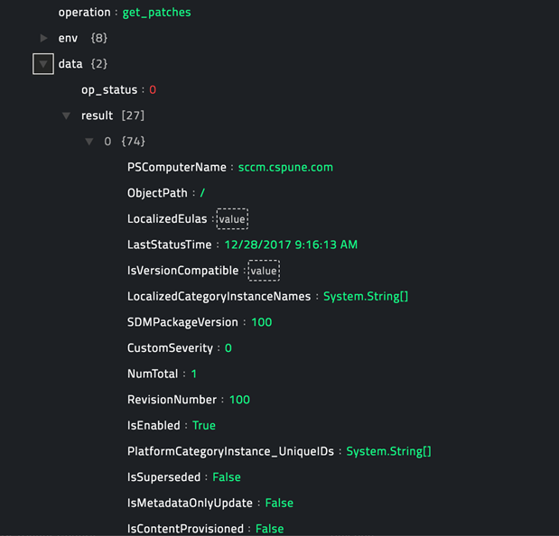
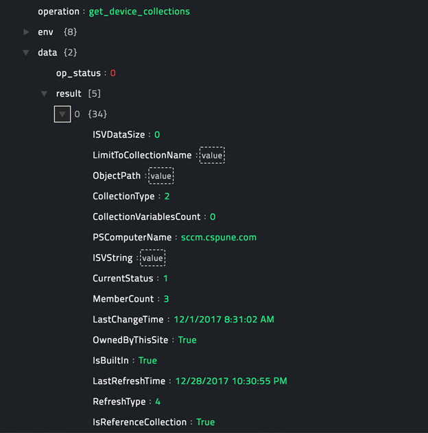
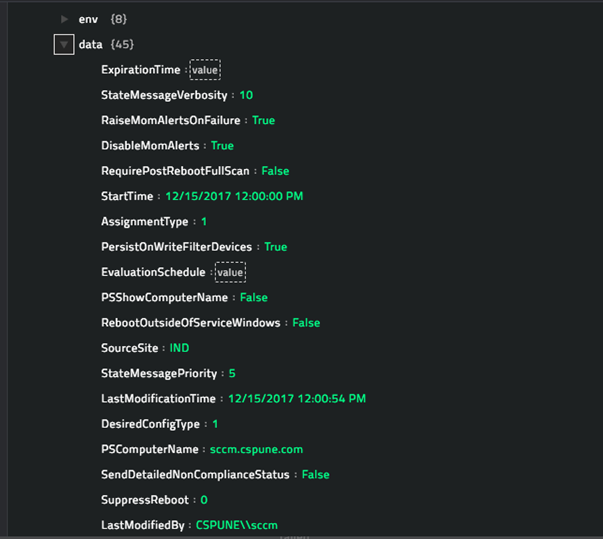

## About the connector

[Microsoft SCCM](https://en.wikipedia.org/wiki/System_Center_Configuration_Manager) is a systems management software product developed by Microsoft for managing large groups of computers. It provides remote control, patch management, software distribution, operating system deployment, network access protection, and hardware and software inventory.

This document provides information about the Microsoft SCCM connector, which facilitates automated interactions, with a Microsoft SCCM  server using CyOPs™ playbooks. Add the Microsoft SCCM  connector as a step in CyOPs™ playbooks and perform automated operations, such as pulling a list of software patches and deploying patches on Device Collections.

### Version information

Connector Version: 1.0.0

Compatibility with CyOPs™ Versions: 4.9.0.0-708 and later

### Annotations associated with Functions

Annotations are added to functions and functions can be accessed by their annotations from CyOPs™ release 4.10.0 onwards.

| Function                   | Annotation   | Annotation Category |
| -------------------------- | ------------ | ------------------- |
| Get All Software Updates   | get_patches  | Investigation       |
| Get All Device Collections | get_devices  | Investigation       |
| Deploy Patch               | deploy_patch | Remediation         |

## Installing the connector

All connectors provided by  CyOPs™ are delivered using a CyOPs™ repository. Therefore, you must set up your CyOPs™ repository and use the `yum` command to install connectors:

`yum install cyops-connector-microsoft-sccm`

To update a  CyOPs™-provided connector use the following command:

`yum update cyops-connector-microsoft-sccm`

To remove a  CyOPs™-provided connector use the following command:

`yum remove cyops-connector-microsoft-sccm`

The process to write your own custom connector is defined in the `Building a custom connector` topic.

## Prerequisites to configuring the connector

- The SCCM server must have Windows Remote Management (WinRM) enabled to run PowerShell commands remotely from your CyOPs™ instance. The http or https port configured for WinRM must be opened for requests from your CyOPs™ instance. See [Microsoft Documentation](https://msdn.microsoft.com/en-us/library/aa384372(v=vs.85).aspx) for information on how to install and configure WinRM.


## Configuring the connector

!!! Note  
		This procedure assumes that you are using CyOPs™ version 4.10.1. If you are using a different version of CyOPs™, such as CyOPs™ 4.9, then it is possible that the CyOPs™ UI navigation is different. Refer to the CyOPs™ documentation of that particular version for details about CyOPs™ navigation.

1. In CyOPs™, on the left pane, click **Automation** > **Connectors**.   
   On the `Connectors` page, you will see the `Microsoft SCCM` connector.

2. To configure the connector parameters, click **Configure** and enter the required configuration details in the **Configurations** tab.  
   You must provide configuration parameters such as the IP address of the Microsoft SCCM  server and credentials to access the Microsoft SCCM server, and WinRM port and protocol.  
   For a complete list of configuration parameters, see the [Configuration parameters](#Configuration-parameters) section.  
   **Note**: You can add multiple configurations if you have more than one Microsoft SCCM  server instances in your environment. You must, therefore, specify a unique `Name` to identify each configuration in your environment.   
   If you have previous versions of a connector and you are configuring a newer version of that connector, with the same configuration parameters, then CyOPs™ fetches the configuration and input parameters of the latest available version of that connector. For example, If you have 1.0.0, 1.1.0, and 1.2.0 versions of the Microsoft SCCM  connector and you are configuring the 1.3.0 version of the Microsoft SCCM  connector, then while configuring the 1.3.0 version,  CyOPs™ will fetch the configuration and input parameters from the 1.2.0 version of the Microsoft SCCM  connector. You can review the configuration and input parameters, and then decide to change them or leave them unchanged. 

3. To save your configuration, click **Save**.  
   To view the list of actions that can be performed by the connector, click the **Actions** 
   tab.  
   To view the list of playbooks bundled with the connector, click the **Sample Playbooks** tab. Refer to the [Included Playbooks](#Included-playbooks) section for details on the bundled playbooks. You can see the bundled playbooks in the **Automation** > **Playbooks** section in  CyOPs™ after importing the Microsoft SCCM connector.

4. (Optional) To check the connectivity to the Microsoft SCCM server and validity of the credentials provided perform a health check, by clicking the **Refresh** icon that is present in the `Health Check` bar.  
   If all the details are correct and the Microsoft SCCM server is available then the health check status displays as `Available`.  
   If any or all the details are incorrect or the Microsoft SCCM server is unavailable then the health check status displays as `Disconnected`.  

   ​

### Configuration parameters<a name="Configuration-parameters"></a>

In CyOPs™, on the Connectors page, select the **Microsoft SCCM** connector and click **Configure** to configure the following parameters:

| Parameter                            | Description                              |
| ------------------------------------ | ---------------------------------------- |
| Address                              | IP address of the Microsoft SCCM server to which you will connect and perform the automated operations. |
| Username                             | Username to access the Microsoft SCCM server. |
| Password                             | Password to access the Microsoft SCCM server. |
| WinRM Port                           | WinRM Port on the Microsoft SCCM server. |
| WinRM Protocol                       | Protocol used for the remote connection, choose between http or https.  <br />By default, https is used. |
| Do Not Fail On WinRM command failure | The default behavior is that all operations of the Microsoft SCCM connector fail if the corresponding Powershell command executed returns a non-0 status code. If you want to check the error message and take subsequent actions in the playbook based on the error, set this value to `True`. In such a case the connector operations do not fail and they return the following JSON response: ` {‘op_status’: -1, ‘result’: ‘<error message>’}`. You can check the status and the result in the subsequent playbook step.  <br />By default, this option is set to `False`. |
| Verify SSL                           | Specifies whether the SSL certificate for the server is to be verified or not. <br />By default, this option is set as `True`. |

**Note**: You can store the passwords and other confidential data using the `Secrets` store provided in CyOPs™. When you store data in the `Secrets` store, users cannot see that data. However, they can use this data when required. For more information about the `Secrets` store, see *Configuring the Secrets store* in the "Administration" guide.

## Actions supported by the connector

The following automated operations can be included in playbooks:

- Get All Software Updates: Fetches a list of Software Updates available on the SCCM server.
- Get All Device Collections: Fetches a list of Device Collections available on the SCCM server.
- Deploy Patch: Deploys a software patch that you specify on all clients belonging to a device group that you specify

### operation: Get All Software Updates

#### Input parameters

None.

#### Output

The JSON output has the following format:  

```
{
	‘op_status’: <command exit status>,
	‘result’: ‘<json list of all software update objects; or the error message in case of failure>’
}
```

Following image displays a sample output:



### operation: Get All Device Collections

#### Input parameters

None.

#### Output

The JSON output has the following format:  

```
{
	‘op_status’: <command exit status>,
	‘result’: ‘<json list of all device collection objects; or the error message in case of failure>’
}
```

Following image displays a sample output:



### operation: Deploy Patch

#### Input parameters

| Parameter              | Description                              |
| ---------------------- | ---------------------------------------- |
| Software Patch Name    | Name of the software patch that you want to deploy. |
| Device Collection Name | Name of the Device Collections to which you want the patch to be deployed. |

**Note**: For the deployment to be successful, the patch must have been download on the distribution point.

#### Output

The JSON output has the following format:  

```
{
	‘op_status’: <command exit status>,
	‘result’: ‘<json list of all deployment attributes; or the error message in case of failure>’
}
```

Following image displays a sample output:




## Included playbooks<a name="Included-playbooks"></a>

The `Sample - Microsoft SCCM - 1.0.0`  playbook collection comes bundled with the Microsoft SCCM connector. This playbook contains steps using which you can perform all supported actions. You can see the bundled playbooks in the **Automation** > **Playbooks** section in  CyOPs™ after importing the Microsoft SCCM connector.

- Deploy Patch

